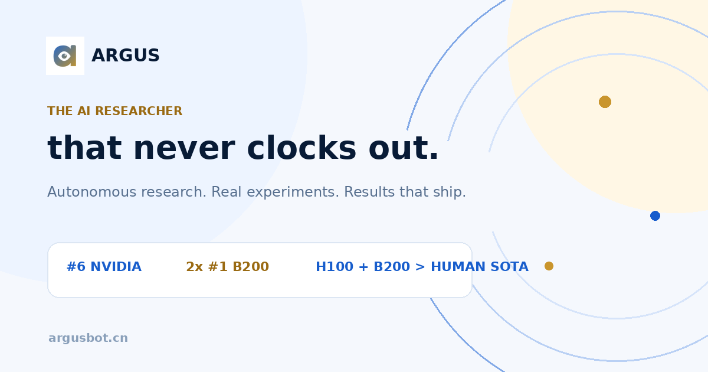
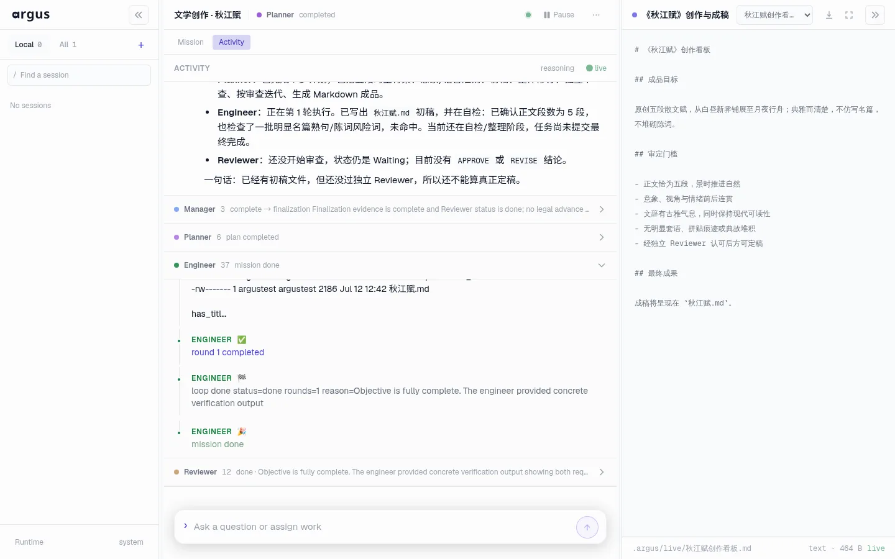

<div align="center">

# Argus

**面向科研与工程的持久、可审查自主运行时。**

让长期 Agent 能够规划、执行、验证、暂停，并在一次模型调用之后继续推进。

[官方网站](https://argusbot.cn) · [真实运行演示](docs/assets/argus-web-demo.webm?raw=1) · [技术报告 · arXiv:2608.05144](https://arxiv.org/pdf/2608.05144) · [English](README.md) / **简体中文**

`Manager` → `Planner` → `Engineer` ⇄ `Reviewer`

</div>

<p align="center">
  <a href="https://argusbot.cn">
    
  </a>
</p>

## 为什么选择 Argus

大多数 Agent 面向一次对话或一次编码回合设计。Argus 面向真正需要持续推进的工作：保存状态、分离执行与判断，并从已经验证的进展继续，而不是每次重新开始。

- **持久，而不是一次性** — 任务、检查点、决策、Skill 与证据会跨 session 和进程升级保存。
- **默认独立审查** — 执行与验证相互分离；每个正常回合都以独立 Reviewer 的判断结束。
- **Agent 原生工作方式** — 角色直接使用真实文件、终端、工具、实验和产物。
- **可扩展到不同领域** — 自定义 Vertical 可以定义自己的阶段、Skill、工具、证据要求与完成标准。

## 运行模型

| | 权威 | 职责 |
|---:|---|---|
| `01` | **Manager · 控制** | 理解 operator 意图、选择工作流，并独占阶段迁移权。 |
| `02` | **Planner · 方向** | 选择下一项高价值任务，并定义它必须产出的证据。 |
| `03` | **Engineer · 执行** | 实现代码、开展调研、运行实验，并生成可检查的产物。 |
| `04` | **Reviewer · 验证** | 独立检查正确性、证据、局限和完成状态。 |

项目可以停止、恢复、跨运行时替换，并从最近一次已验证位置继续推进。

**原生 Backend：** `GitHub Copilot CLI` · `Pi` · `OpenAI Codex CLI` · `Claude Code` · `OpenCode`

## ▶ 看看 Argus 如何工作

<p align="center">
  <a href="docs/assets/argus-web-demo.webm?raw=1">
    
  </a>
</p>

<p align="center">
  <sub>真实 Web UI 运行回放，点击图片播放完整视频。</sub>
</p>

## 快速开始

### 环境要求

- Python 3.11+
- Node.js 22+
- 至少一个已按官方方式安装并完成登录鉴权的 Agent CLI

### 安装

```bash
git clone https://github.com/lbx154/Argus.git
cd Argus

python3 -m venv .venv
. .venv/bin/activate
python -m pip install --upgrade pip
pip install -e .
```

### 连接后端

```bash
argus --setup --non-interactive \
  --backend copilot \
  --accept-house-rules
```

`--backend` 可使用 `copilot`、`pi`、`codex`、`claude` 或 `opencode`。

### 启动

```bash
argus
```

```bash
argus --doctor   # 检查安装与后端
argus --status   # 查看当前运行状态
```

## 交互界面

### Terminal Cockpit

```bash
argus
```

通过终端 Cockpit 与 Manager 对话、跟踪实时工作、检查状态并恢复项目。

### Web UI

启动 Argus，并在默认浏览器中打开 Web UI：

```bash
argus --web
```

默认地址：[http://127.0.0.1:8799](http://127.0.0.1:8799)

```bash
argus --web --no-open    # 只启动，不打开浏览器
argus --web --port 8800  # 使用其他端口
```

#### 通过 SSH 使用远程服务器

在服务器上：

```bash
argus --web --no-open
```

在自己的电脑上：

```bash
ssh -L 8799:127.0.0.1:8799 user@server
```

然后在本机打开 [http://127.0.0.1:8799](http://127.0.0.1:8799)。

<details>
<summary><strong>直接通过局域网访问</strong></summary>

直接访问局域网时，必须使用 Bearer Token 保护服务：

```bash
export ARGUS_SKILL_WEB_TOKEN="$(python -c 'import secrets; print(secrets.token_urlsafe(32))')"
printf '%s\n' "$ARGUS_SKILL_WEB_TOKEN"
argus --web --host 0.0.0.0 --port 8799 --no-open
```

从其他设备打开下面的地址，并替换服务器 IP 与 Token：

```text
http://SERVER_IP:8799/?token=YOUR_TOKEN
```

禁止在未设置 `ARGUS_SKILL_WEB_TOKEN` 时将服务暴露到 `0.0.0.0`。

</details>

## 高级使用

Argus 的设计目标不是“只能配置”，而是“可以被你改变”。

### 改造整个运行时

如果你是 Agent 的狂热爱好者，我们推荐你在本地部署 Argus，让完整闭环真正适合自己的工作方式。你可以调整角色 Prompt、工作流边界、审查策略、工具与运行约定，对接已有基础设施，并用测试固定自己重视的行为。

### 创建自己的 Vertical

Vertical 可以为你的领域提供专属阶段、Skill、数据集、工具、证据要求、评测方法与完成标准。规划与审查将遵循该领域真正重要的规范，而不是一套通用流程。

### 让其他 Agent 成为外层入口

你可以通过 GitHub Copilot、Pi、Codex、Claude Code、OpenCode、OpenClaw 或 Hermes 调用 Argus、检查状态、操作本地 CLI 或 Web/API，并继续迭代自己的部署。

- **Argus 原生 Backend：** GitHub Copilot CLI、Pi、Codex CLI、Claude Code、OpenCode
- **外层 Agent：** OpenClaw、Hermes，或任何能够使用 Shell / HTTP API 的 Agent

常用入口：

```bash
argus --doctor
argus --status
argus --web --no-open
```

最强大的 Argus 往往是一套被你认真改造成更适合自己伟大领域与工作方式的 Argus。

## 更新

```bash
cd Argus
git pull --ff-only
.venv/bin/python -m pip install -e .
.venv/bin/argus
```

Argus 会识别过期的本地 WebAPI 与 daemon，并在受控任务边界完成替换。
